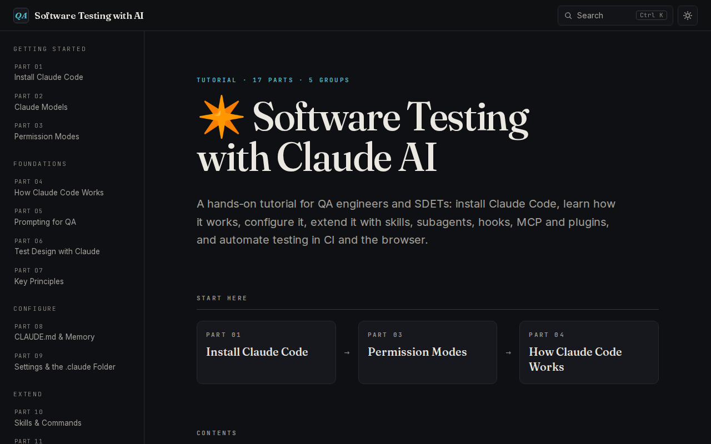
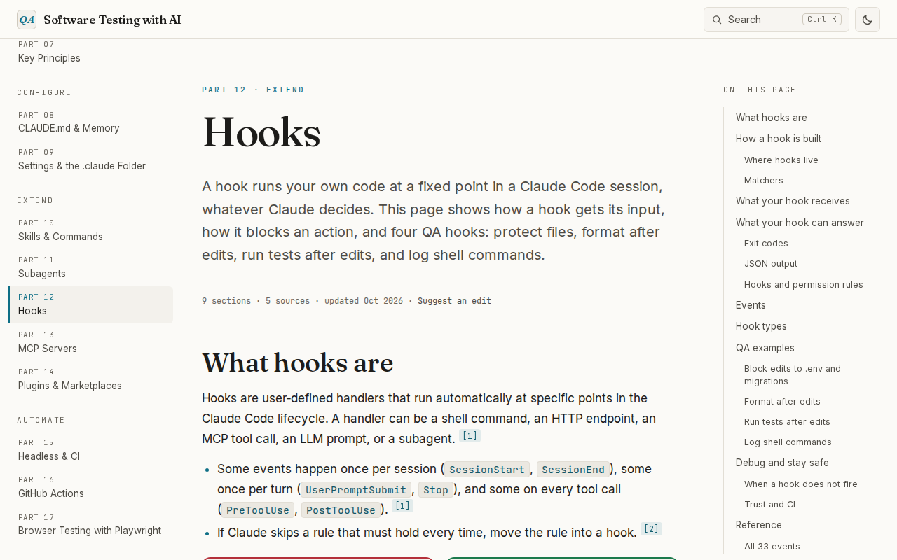

# Software Testing with AI

A free tutorial that teaches QA engineers and SDETs how to use Claude Code for software testing.

**Read it:** https://kawsar-95.github.io/learn-software-testing-with-ai/

[](https://github.com/kawsar-95/learn-software-testing-with-ai/actions/workflows/deploy-pages.yml)
[](LICENSE)



## What you learn

The tutorial has 23 parts in 6 groups. Each part is one page.

| Group | Parts |
|---|---|
| **Getting Started** | 01 [Install Claude Code](https://kawsar-95.github.io/learn-software-testing-with-ai/getting-started/setup/) · 02 [Claude Models](https://kawsar-95.github.io/learn-software-testing-with-ai/getting-started/models/) · 03 [Permission Modes](https://kawsar-95.github.io/learn-software-testing-with-ai/getting-started/permission-modes/) |
| **Foundations** | 04 [How Claude Code Works](https://kawsar-95.github.io/learn-software-testing-with-ai/foundations/how-claude-code-works/) · 05 [Prompting for QA](https://kawsar-95.github.io/learn-software-testing-with-ai/foundations/prompting/) · 06 [Test Design with Claude](https://kawsar-95.github.io/learn-software-testing-with-ai/foundations/test-design/) · 07 [Key Principles](https://kawsar-95.github.io/learn-software-testing-with-ai/foundations/principles/) |
| **Configure** | 08 [CLAUDE.md & Memory](https://kawsar-95.github.io/learn-software-testing-with-ai/configure/claude-md/) · 09 [Settings & the .claude Folder](https://kawsar-95.github.io/learn-software-testing-with-ai/configure/settings/) |
| **Extend** | 10 [Skills & Commands](https://kawsar-95.github.io/learn-software-testing-with-ai/extend/skills/) · 11 [Subagents](https://kawsar-95.github.io/learn-software-testing-with-ai/extend/subagents/) · 12 [Hooks](https://kawsar-95.github.io/learn-software-testing-with-ai/extend/hooks/) · 13 [MCP Servers](https://kawsar-95.github.io/learn-software-testing-with-ai/extend/mcp/) · 14 [Plugins & Marketplaces](https://kawsar-95.github.io/learn-software-testing-with-ai/extend/plugins/) |
| **Automate** | 15 [Headless & CI](https://kawsar-95.github.io/learn-software-testing-with-ai/automate/headless/) · 16 [GitHub Actions](https://kawsar-95.github.io/learn-software-testing-with-ai/automate/github-actions/) · 17 [Browser Testing with Playwright](https://kawsar-95.github.io/learn-software-testing-with-ai/automate/playwright/) |
| **Case Study** | 18 [The Practice Project](https://kawsar-95.github.io/learn-software-testing-with-ai/case-study/overview/) · 19 [Bug Hunting with a Review Gate](https://kawsar-95.github.io/learn-software-testing-with-ai/case-study/bug-hunt/) · 20 [From Issue to Reviewed PR](https://kawsar-95.github.io/learn-software-testing-with-ai/case-study/pr-review/) · 21 [Design, Execute, Fix, Retest](https://kawsar-95.github.io/learn-software-testing-with-ai/case-study/test-and-retest/) · 22 [Load and Browser Automation](https://kawsar-95.github.io/learn-software-testing-with-ai/case-study/automation/) · 23 [What to Fix in the Setup](https://kawsar-95.github.io/learn-software-testing-with-ai/case-study/lessons/) |

New to Claude Code? Start with parts 01, 03, and 04. To see the features work together in one real QA project, read parts 18–23.

## How the content is made

Every page states facts that a reader can check.

- **Sources:** facts come from official docs first (`code.claude.com/docs`, `platform.claude.com/docs`, `modelcontextprotocol.io`, `playwright.dev`, and the GitHub repos of the tools), then from primary sources such as the ISTQB syllabi. Blogs, forums, and AI summaries are not used.
- **Citations:** each fact has a numbered `[n]` link to the Sources list at the end of its page. The 23 pages have 1,535 citations to 83 different sources.
- **Fact-check:** an agent that did not write the page checked each claim against its cited source. Each page has a report in [`docs/superpowers/research/`](docs/superpowers/research/), and all 23 reports end with `Open FAILs: 0`.
- **Case study:** parts 18–23 describe the author's private practice workspace. Facts about that workspace have no citation link. A separate agent checked each one against the workspace files. Emails, phone numbers, and similar values are replaced with placeholders.
- **Dates:** each page shows the date of its last update. "Suggest an edit" opens the page source on GitHub.

Claude Code changes often. If a page is out of date, open an issue or a pull request.



## Features

- Light and dark themes, with no flash of the wrong theme on load.
- Search across all pages and sections (<kbd>Ctrl</kbd>/<kbd>Cmd</kbd>+<kbd>K</kbd>).
- An "On this page" list, a reading progress bar, and a back-to-top button.
- Code blocks with syntax colors and a Copy button.
- Installs as an app and works offline.
- Works on phones: a drawer menu, and tables and code that scroll inside their own box.

## Run it locally

You need Node.js 22.18 or newer. The check scripts also need Python 3.

```bash
git clone https://github.com/kawsar-95/learn-software-testing-with-ai.git
cd learn-software-testing-with-ai
npm install
npm run dev
```

Open http://localhost:3000.

To build and preview the static site:

```bash
npm run build                          # writes the static site to out/
python3 -m http.server 8000 -d out     # serves it at http://localhost:8000
```

`next start` does not work with a static export. Use the preview command above.

## Scripts and checks

| Command | What it does |
|---|---|
| `npm run dev` | Starts the dev server. The offline app (service worker) works only in a production build. |
| `npm run build` | Builds the static site into `out/`. |
| `npm test` | Runs the unit tests in `tests/` with `node --test`. |
| `python3 -m unittest scripts/test_checks.py` | Runs the unit tests of the Python check scripts. |
| `python3 scripts/check_routes.py out` | Checks that every route has a built page. |
| `python3 scripts/check_links.py out` | Checks internal links and assets. |
| `python3 scripts/check_outline.py out` | Checks that every "On this page" link has a target. |
| `python3 scripts/check_sources.py out` | Checks the meta line, the citations, and the Sources list of each page. It must print `OK 23 pages checked, 0 skipped`. |

Run the `out` checks after `npm run build`, on a build without a base path.

## Project structure

```text
app/                 Routes, root layout, global styles, sitemap, robots, search index, PWA files
components/          Site shell, navigation, page parts, MDX components, home page
content/<group>/     The 23 tutorial pages as MDX files
lib/                 nav.ts (page order), search, outline, theme, PWA, and other helpers
tests/               Unit tests (node --test)
scripts/             Python check scripts and route-map.json
public/              Icons and static files
docs/                Architecture, design specs, plans, the content audit, research notes
```

For how the parts fit together, read [docs/ARCHITECTURE.md](docs/ARCHITECTURE.md).

## Add or change a page

1. Create or edit `content/<group>/<slug>.mdx`. Use the page template in [CLAUDE.md](CLAUDE.md#page-template).
2. For a new page, add it to `lib/nav.ts` and to `scripts/route-map.json`.
3. Give each fact a `<Cite n={k} />` and a matching entry in `page.sources`.
4. Run `npm test`, `npm run build`, and the checks above.

[CLAUDE.md](CLAUDE.md) has the full rules: the MDX components, the citation rules, and the research and fact-check workflow. It is written as the guide for AI coding agents, and it is the most complete reference for humans too.

## Deploy

Each push to `main` deploys the site to GitHub Pages through [`.github/workflows/deploy-pages.yml`](.github/workflows/deploy-pages.yml). The workflow runs `npm ci`, `npm test`, and `npm run build`, then publishes `out/`.

The site lives under `/learn-software-testing-with-ai/`. The workflow sets `PAGES_BASE_PATH` for that path and `NEXT_PUBLIC_SITE_URL` for canonical URLs and the sitemap. Local builds serve from `/`. See [docs/ARCHITECTURE.md](docs/ARCHITECTURE.md#base-path-github-pages) for the rules that keep links correct under the base path.

`NEXT_PUBLIC_GA_ID` is optional. If you set it, the build adds Google Analytics.

## Tech stack

| Part | Choice |
|---|---|
| Framework | Next.js 16 (App Router, static export), React 19, TypeScript |
| Content | MDX with `@next/mdx`, `remark-gfm`, `rehype-slug`, and Shiki (`@shikijs/rehype`) |
| Styles | Tailwind CSS 4 and CSS design tokens |
| Search | MiniSearch, with a static search index |
| Hosting | GitHub Pages, deployed by GitHub Actions |

## Credits

- Tutorial and code by [kawsar-95](https://github.com/kawsar-95).
- The design (layout, colors, fonts) comes from [All Necessary Topics Related to AI Engineering](https://github.com/kawsar-95/All-Necessary-Topics-Related-to-AI-Engineering).
- This is an independent tutorial. Anthropic does not maintain or endorse it.

## License

[MIT](LICENSE)
