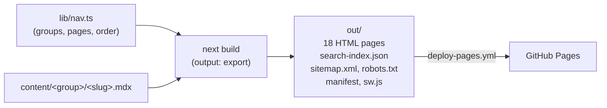

# Architecture

This document explains how the site is built and how its parts work together. It is for developers who change the code or add content. For the step-by-step rules (page template, MDX components, citation rules), read [CLAUDE.md](../CLAUDE.md).

## Overview

The site is a static export of a Next.js 16 App Router project. There is no server and no database. The build reads the MDX files in `content/`, renders every page to HTML, and writes the result to `out/`. GitHub Pages serves `out/`.



`lib/nav.ts` and the MDX files are the inputs. Everything else is code that turns them into pages.

## Routes

| Route | Source | Output |
|---|---|---|
| `/` | `app/(site)/page.tsx` → `components/pages/HomePage.tsx` | The home page: START HERE strip and the contents by group |
| `/<group>/<slug>/` | `app/(site)/[group]/[page]/page.tsx` | The 17 content pages |
| `/search-index.json` | `app/search-index.json/route.ts` | The search documents (static) |
| `/sitemap.xml`, `/robots.txt` | `app/sitemap.ts`, `app/robots.ts` | SEO files |
| `/manifest.webmanifest`, `/sw.js` | `app/manifest.ts`, `app/sw.js/route.ts` | The installable app and its service worker |
| 404 | `app/not-found.tsx` | The 404 page |

`app/layout.tsx` is the root layout: fonts, the theme init script, metadata, and optional Google Analytics. `app/(site)/layout.tsx` wraps every page in `SiteShell` (header, sidebar, footer) and adds the search dialog.

All route handlers use `export const dynamic = "force-static"`, so the build writes their output as files.

## Navigation: one source

`lib/nav.ts` holds one ordered list of groups and pages. Each page has a `slug`, a `title`, a `description`, and a `tagline`. The module derives the rest:

| Derived value | Used by |
|---|---|
| `part` (1–17, continuous across groups) | The `PART 05` labels in the sidebar, the page eyebrow, prev/next, search results |
| `href` (`/<group>/<slug>/`) | Every link to a page |
| `PAGES`, `GROUPS` | The sidebar, the home contents, `generateStaticParams`, the sitemap, the search index, the precache list |
| `getNeighbors(group, slug)` | The prev/next cards |

Because these all read the same list, a new page needs one entry in `lib/nav.ts` (plus its MDX file and a line in `scripts/route-map.json`). `tests/nav.test.ts` fails if the list and the files in `content/` do not match.

## Content pages

### The MDX file

Each page exports two objects and then starts with its title:

```mdx
export const metadata = { title: '…', description: '…' }
export const page = { updated: 'YYYY-MM-DD', sources: [ { title, publisher, url, accessed } ] }

# Title

Lede paragraph.

<PageMeta />

## First section
```

- `metadata` is the standard Next.js metadata object. The page route returns it from `generateMetadata`.
- `page` (type `PageInfo` in `lib/page.ts`) holds the update date and the numbered sources.
- `<PageMeta />` is a placeholder. The page route fills it in (see below).

### The MDX pipeline

`next.config.ts` wraps the config with `@next/mdx` and these plugins:

| Plugin | Job |
|---|---|
| `remark-gfm` | GitHub-flavored Markdown: tables, task lists, strikethrough |
| `rehype-slug` | Gives every heading an `id` |
| `@shikijs/rehype` | Syntax colors at build time (theme `github-dark-dimmed`) |

The plugins are given by name (strings), because Turbopack passes their options to Rust and they must be serializable.

`mdx-components.tsx` maps MDX elements and components:

| MDX | Rendered by |
|---|---|
| `Callout`, `CardGrid`, `InfoCard`, `Cite` | `components/mdx/` |
| `pre` (fenced code) | `CodeBlock`: language label and Copy button |
| `table` | A wrapper that scrolls sideways on narrow screens |
| `a` with an `href` that starts with `/` | `next/link` (adds the base path) |

### The page route

`app/(site)/[group]/[page]/page.tsx` does this for each page:

1. Gets the page from `lib/nav.ts`. Unknown params give a 404 (`dynamicParams = false`).
2. Imports `content/<group>/<page>.mdx` with a dynamic import.
3. Reads the outline with `getOutline(group, slug)`.
4. Renders:
   - `ReadingProgress` (the bar under the header)
   - `PageHeader` (the eyebrow, for example `PART 08 · CONFIGURE`)
   - `<article data-content className="mdx">` with the MDX content. `PageMeta` is passed as a component that renders `MetaLine`: the number of `##` sections, the number of sources, the update date, and the "Suggest an edit" link (`editUrl` in `lib/page.ts`).
   - `Sources` (the numbered list from `page.sources`, ids `src-1`, `src-2`, …)
   - `PrevNext`
   - `SectionNav` ("On this page", only at 1280 px and wider)
   - `BackToTop`

### Headings, outline, and anchors

The "On this page" list and the search results link to heading ids. Those ids must match the ids that `rehype-slug` writes into the HTML.

`lib/headings.ts` reads the MDX source, skips fenced code, and slugs every heading (levels 1–6, in document order) with one `github-slugger` instance per page. This is the same algorithm as `rehype-slug`, so a repeated heading gets the same `-1` suffix in both. `lib/outline.ts` returns the level 2 and 3 headings from it, and `lib/search.ts` uses it for section links. `scripts/check_outline.py` checks the built HTML: every "On this page" link must have a matching id.

## Search

| Step | Where | What happens |
|---|---|---|
| Build | `app/search-index.json/route.ts` | Reads every MDX file and calls `buildSearchDocs` (`lib/search.ts`). One document per page intro and one per `##` section. The text has the Markdown and JSX syntax removed. Code text is kept. |
| First open | `components/navigation/SearchPalette.tsx` | <kbd>Ctrl</kbd>/<kbd>Cmd</kbd>+<kbd>K</kbd> or the header button opens the dialog. On the first open it fetches `search-index.json` and builds a MiniSearch index in the browser. |
| Query | `lib/search.ts` (`runSearch`) | Prefix and fuzzy search. Titles count 3×, page names 1.5×. Up to 8 results. |

`lib/search.ts` must not import `node:fs` or `lib/outline.ts`, because the browser bundle imports it. It uses `lib/headings.ts`, which has no Node dependency.

## Theme

- Two themes: dark (the default) and light. The design tokens are CSS variables in `app/globals.css`, one set per theme on `<html data-theme>`. `@theme inline` maps them to Tailwind colors such as `bg-bg-raised` and `text-accent`.
- The server HTML has `data-theme="dark"`. An inline script (`THEME_INIT_SCRIPT` in `lib/theme.ts`) runs in `<head>` before the first paint. A saved choice (`localStorage` key `theme`) wins. Without one, the script follows `prefers-color-scheme`. So a reader never sees the wrong theme first.
- `ThemeToggle` switches the theme and saves the choice.
- `tests/theme.test.ts` runs the init script in a VM and checks that it gives the same result as `resolveTheme`.
- Every text color has a contrast of 4.5:1 or more on its background in both themes.

The design (tokens, fonts, layout) comes from the owner's reference site, [All Necessary Topics Related to AI Engineering](https://github.com/kawsar-95/All-Necessary-Topics-Related-to-AI-Engineering). Fonts load with `next/font/google`: Fraunces (headings), Inter (body), and JetBrains Mono (labels and code).

## Site shell

| Component | Job |
|---|---|
| `SiteShell` | Skip link, header, sticky sidebar (1024 px and wider), main area, footer |
| `SiteHeader` | Logo, search button, theme toggle, menu button (below 1024 px) |
| `Sidebar`, `SidebarList` | The groups and parts. The current page has `aria-current="page"` and scrolls into view inside the sidebar. |
| `MobileNav` | The drawer for small screens: focus trap, Escape to close, page scroll lock |
| `RegisterServiceWorker` | Registers `/sw.js` in production builds |

`lib/scroll-lock.ts` is one shared lock for page scrolling. The drawer and the search dialog both use it, so closing them in any order unlocks the page correctly.

The reading aids are on content pages only. `ReadingProgress` tracks how much of the article is read. `BackToTop` appears after one screen of scrolling. The math is in `lib/reading.ts` and has unit tests.

## Installable app (PWA)

`lib/pwa.ts` builds the web manifest and the service worker source.

| Part | Behavior |
|---|---|
| Install | Caches all 18 routes, the 404 page, the search index, the manifest, and the icons (`precacheUrls`), plus the build files the pages use |
| Pages and other requests | Network first. An online reader gets the newest version; the cache answers when the network fails. |
| `/_next/static/` files | Cache first. Their file names have a content hash. |
| Offline, page not cached | Shows the cached 404 page |
| New build | `/sw.js` gets a new cache version. The new worker deletes older caches. |

Only production builds register the service worker. `npm run dev` has none, so dev pages never come from an old cache.

## SEO and environment variables

`lib/site.ts` reads two optional variables. A build without them passes.

| Variable | Effect |
|---|---|
| `NEXT_PUBLIC_SITE_URL` | Sets `metadataBase`, canonical URLs, Open Graph URL and image, the `sitemap.xml` entries, and the sitemap line in `robots.txt`. Without it, there are no canonical URLs and the sitemap is empty. |
| `NEXT_PUBLIC_GA_ID` | Adds Google Analytics (`@next/third-parties`). |

The 404 page has no canonical URL and no Open Graph data.

## Base path (GitHub Pages)

GitHub Pages serves the site at `/learn-software-testing-with-ai/`. The deploy workflow sets `PAGES_BASE_PATH` to that path. `next.config.ts` uses it as `basePath` and exposes it to the browser as `NEXT_PUBLIC_BASE_PATH` (`BASE_PATH` in `lib/site.ts`). Local builds leave it empty and serve from `/`.

| Adds the base path by itself | Needs the base path added by hand |
|---|---|
| `next/link`, `router.push`, metadata URLs | `fetch()`, plain `<a href>`, service worker URLs, manifest URLs |

So:

- `SearchPalette` prefixes the base path to its `fetch`.
- `mdx-components.tsx` renders MDX links that start with `/` through `next/link`.
- `lib/pwa.ts` and `RegisterServiceWorker` build every URL from the base path.
- In content, write internal links as `/group/page/`. Never include the repository name.

## Deploy

`.github/workflows/deploy-pages.yml` runs on every push to `main` and on manual dispatch:

1. `actions/configure-pages` gives the base path and the site URL.
2. `npm ci` and `npm test`.
3. `npm run build` with `PAGES_BASE_PATH` and `NEXT_PUBLIC_SITE_URL`.
4. Upload `out/` and deploy it with `actions/deploy-pages`.

The Python checks are not part of the workflow, because they expect a build without a base path. Run them locally before you push.

## Tests and checks

| Check | Type | What it protects |
|---|---|---|
| `npm test` | Node unit tests (`tests/*.test.ts`) | Nav order and parts, outline ids, search docs and ranking, theme script, page helpers, reading aids, home helpers, UI strings, PWA manifest and precache list |
| `python3 -m unittest scripts/test_checks.py` | Python unit tests | The check scripts themselves |
| `check_routes.py out` | Build check | Every route in `scripts/route-map.json` has a page |
| `check_links.py out` | Build check | No broken internal links or assets |
| `check_outline.py out` | Build check | Every "On this page" link has a target id |
| `check_sources.py out` | Build check | Each content page has one meta line, at least one source, a source for every `[n]` cite, a cite for every source, and `https://` source links |

`scripts/route-map.json` is the list of routes that the build checks read. Every page must be in it. `npm test` checks this too.

`scripts/compare_text.py` is a record of an earlier migration. It cannot run now.

## Content workflow

The tutorial text follows a source-first process. The details are in [CLAUDE.md](../CLAUDE.md#content-workflow).

1. **Research:** collect sources and quotes in `docs/superpowers/research/<group>-<slug>.md`.
2. **Write:** change the MDX. Each fact gets a `<Cite n>` and a `page.sources` entry.
3. **Fact-check:** a separate reviewer checks each claim against its source and writes `docs/superpowers/research/<group>-<slug>.factcheck.md`. The page is done when the report ends with `Open FAILs: 0`.
4. **Verify:** `npm run build` and `python3 scripts/check_sources.py out`.

## Project history

The design documents in `docs/superpowers/` record how the site got here:

| Phase | Spec | Plan |
|---|---|---|
| 1. Move to grouped URLs (Nextra, later replaced) | [spec](superpowers/specs/2026-10-09-nextra-reorganization-design.md) | [plan](superpowers/plans/2026-10-09-nextra-reorganization.md) |
| 3. Editorial redesign (custom shell) | [spec](superpowers/specs/2026-10-09-editorial-redesign-design.md) | [plan](superpowers/plans/2026-10-09-editorial-redesign.md) |
| 2. Content refresh (17 cited pages) | [spec](superpowers/specs/2026-10-10-content-refresh-design.md) | [plan](superpowers/plans/2026-10-10-content-refresh.md) |

The [content audit](superpowers/audits/2026-10-09-content-audit.md) lists the outdated claims of the old tutorial and, in its resolution section, the page that fixes each one.
